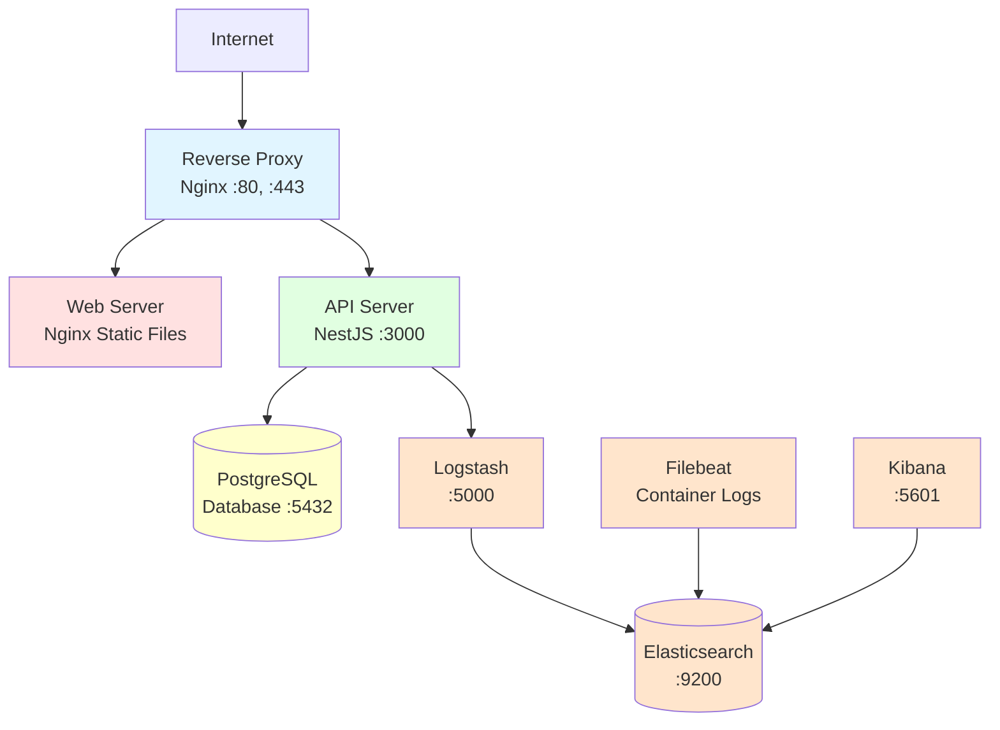
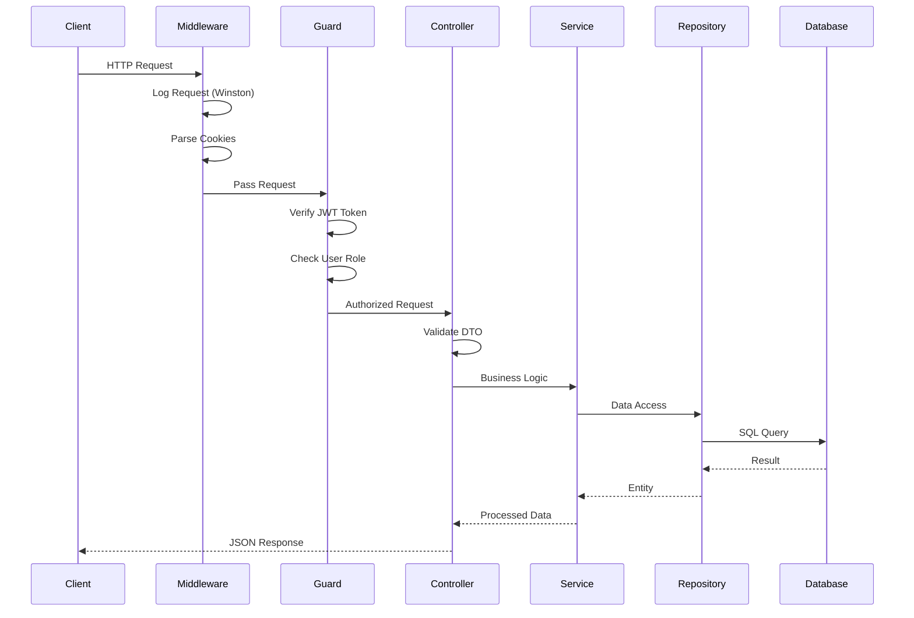
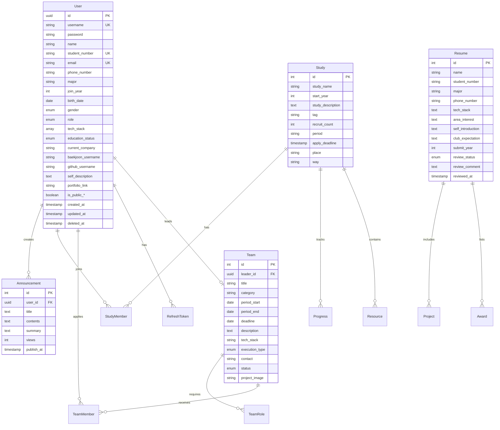
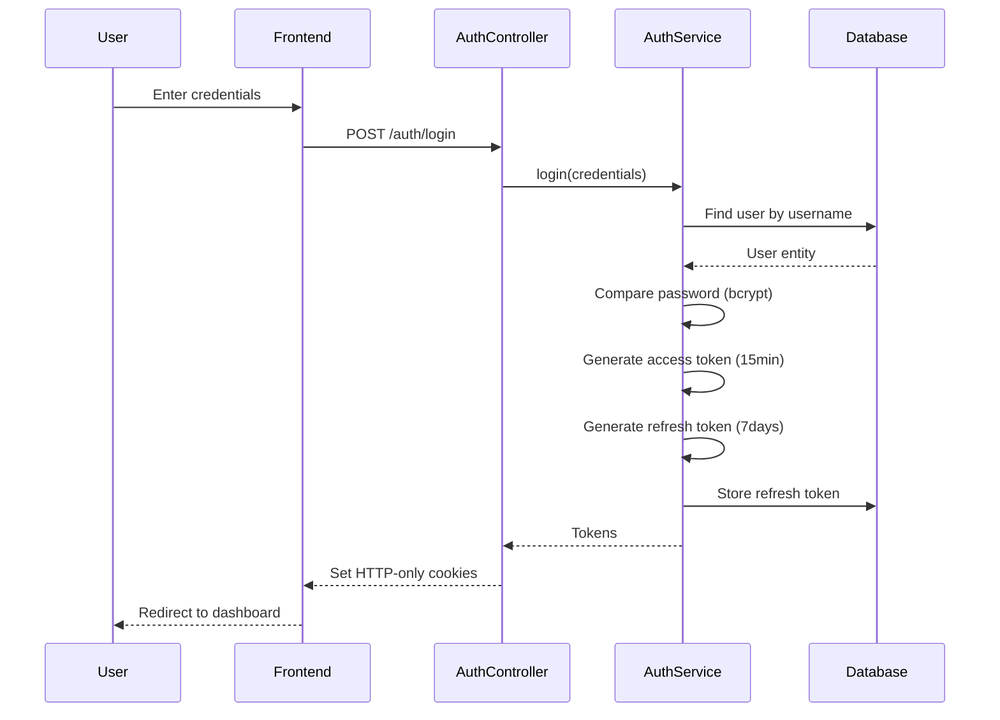

# TCP Website 2025 - Project Documentation

> **Purpose**: This documentation provides a comprehensive overview of the TCP (Team Crazy Performance) website project. It's designed to help junior developers understand the complete system architecture, codebase structure, and how all components work together.

---

## Table of Contents

1. [Project Overview](#project-overview)
2. [Technology Stack](#technology-stack)
3. [Project Structure](#project-structure)
4. [Infrastructure & Deployment](#infrastructure--deployment)
5. [Backend Architecture (API)](#backend-architecture-api)
6. [Frontend Architecture (Web)](#frontend-architecture-web)
7. [Database Models](#database-models)
8. [Authentication & Authorization](#authentication--authorization)
9. [Key Features](#key-features)
10. [Development Workflow](#development-workflow)
11. [Testing](#testing)
12. [Deployment Checklist](#deployment-checklist)

---

## Project Overview

### What is TCP Website 2025?

TCP Website 2025 is a full-stack web application designed for managing a university computer science club. The platform provides:

- **Member Management**: User registration, profiles, and authentication
- **Study Groups**: Create and manage study groups with resources and progress tracking
- **Team/Project Recruitment**: Post and manage team recruitment for projects
- **Announcements**: Club announcements and news
- **Admin Dashboard**: Comprehensive admin panel for managing all aspects of the club
- **Recruitment System**: Handle new member applications with resume submissions

### Project Goals

- Provide a centralized platform for club activities
- Streamline member recruitment and onboarding
- Facilitate collaboration through study groups and project teams
- Enable efficient club administration

---

## Technology Stack

### Frontend

| Technology | Version | Purpose |
|------------|---------|---------|
| **React** | 19.1.0 | UI framework for building the single-page application |
| **React Router** | 7.7.0 | Client-side routing |
| **Chart.js** | 4.5.0 | Data visualization for admin dashboard |
| **FontAwesome** | 7.0.0 | Icon library |
| **DOMPurify** | 3.1.5 | Sanitize HTML to prevent XSS attacks |
| **markdown-it** | 14.1.0 | Render markdown content |

### Backend

| Technology | Version | Purpose |
|------------|---------|---------|
| **NestJS** | 11.0.1 | Progressive Node.js framework |
| **TypeScript** | 5.7.3 | Type-safe JavaScript |
| **TypeORM** | 0.3.26 | ORM for database operations |
| **PostgreSQL** | 16 | Relational database |
| **JWT** | 11.0.0 | Authentication tokens |
| **bcrypt** | 6.0.0 | Password hashing |
| **Passport** | 0.7.0 | Authentication middleware |

### Infrastructure

| Component | Technology | Purpose |
|-----------|------------|---------|
| **Reverse Proxy** | Nginx 1.25-alpine | Route traffic to web/api services |
| **Static Web Server** | Nginx 1.25-alpine | Serve frontend build files |
| **Database** | PostgreSQL 16-alpine | Persistent data storage |
| **Logging Stack** | ELK Stack (Elasticsearch, Logstash, Kibana, Filebeat) 8.9.0 | Centralized logging and monitoring |
| **Container Orchestration** | Docker Compose | Multi-container management |

### Development Tools

- **Prettier**: Code formatting
- **ESLint**: Code linting
- **Jest**: Testing framework
- **Supertest**: HTTP testing

---

## Project Structure

```
TCP_Wetsite_2025/
├── api/                          # Backend (NestJS)
│   ├── src/
│   │   ├── admin/               # Admin-specific modules
│   │   ├── announcement/        # Announcements management
│   │   ├── auth/                # Authentication & authorization
│   │   ├── health/              # Health check endpoints
│   │   ├── jobs/                # Scheduled jobs (cron)
│   │   ├── logger/              # Winston logger configuration
│   │   ├── members/             # Public member operations
│   │   ├── mypage/              # User profile & settings
│   │   ├── recruitment/         # Member recruitment system
│   │   ├── study/               # Study groups management
│   │   ├── teams/               # Team/project recruitment
│   │   ├── app.module.ts        # Root application module
│   │   ├── main.ts              # Application entry point
│   │   └── seed.ts              # Database seeding script
│   ├── test/                    # E2E and unit tests
│   ├── uploads/                 # User-uploaded files
│   ├── Dockerfile               # Docker build instructions
│   └── package.json             # Backend dependencies
│
├── web/                         # Frontend (React)
│   ├── public/                  # Static assets
│   ├── src/
│   │   ├── api/                 # API client utilities
│   │   ├── components/          # Reusable React components
│   │   │   ├── modals/         # Modal components
│   │   │   └── ui/             # UI components (forms, inputs)
│   │   ├── data/                # Static/mock data
│   │   ├── pages/               # Page components (routes)
│   │   │   ├── admin/          # Admin pages
│   │   │   └── mypage/         # User profile pages
│   │   ├── utils/               # Utility functions
│   │   ├── App.js               # Main app component with routing
│   │   ├── App.css              # Global styles
│   │   └── index.js             # Application entry point
│   ├── dist/                    # Production build output
│   ├── nginx.conf               # Nginx configuration for serving
│   └── package.json             # Frontend dependencies
│
├── db/                          # Database-related files
│   └── backups/                 # Database backups directory
│
├── elk/                         # ELK Stack configuration
│   ├── elasticsearch/           # Elasticsearch config
│   ├── kibana/                  # Kibana config
│   ├── logstash/                # Logstash pipelines
│   └── filebeat/                # Filebeat config
│
├── envs/                        # Environment variables
│   ├── api.env                  # Backend environment variables
│   ├── db_dev.env               # Development DB configuration
│   ├── db_prod.env              # Production DB configuration
│   └── elk.env                  # ELK Stack credentials
│
├── logs/                        # Application logs
│
├── reverse-proxy/               # Nginx reverse proxy
│   ├── default.conf             # Nginx routing configuration
│   └── certs/                   # SSL certificates (for HTTPS)
│
├── docker-compose.yml           # Production Docker Compose
├── docker-compose.dev.yml       # Development Docker Compose
├── DEPLOYMENT_CHECKLIST.md      # Pre-deployment checklist
└── README.md                    # Project README
```

---

## Infrastructure & Deployment

### Docker Architecture

The application uses a **microservices architecture** with Docker Compose orchestrating multiple containers:



### Network Topology

- **Public Network**: Only reverse-proxy is exposed to the internet (ports 80, 443)
- **Internal Network**: All other services communicate internally
  - Database: Not exposed externally (security)
  - API: Accessible only through reverse proxy
  - ELK Stack: Internal only (access via SSH tunneling)

### Key Services

#### 1. Reverse Proxy (Nginx)
- **Purpose**: Entry point for all HTTP/HTTPS requests
- **Routes**:
  - `/api/*` → API server
  - `/*` → Static web files
- **Configuration**: `reverse-proxy/default.conf` (currently empty - needs setup)

#### 2. Web Server (Nginx)
- **Purpose**: Serve React production build
- **Serves from**: `./web/dist/`
- **Configuration**: `./web/nginx.conf`

#### 3. API Server (NestJS)
- **Purpose**: Backend REST API
- **Port**: 3000 (internal)
- **Environment**: Production (`NODE_ENV=production`)
- **Volumes**:
  - `./api/uploads` → User uploads
  - `./logs/app` → Application logs

#### 4. PostgreSQL Database
- **Purpose**: Primary data storage
- **Version**: 16-alpine
- **Persistence**: `db-data` Docker volume
- **Backups**: `./db/backups/`

#### 5. ELK Stack (Logging & Monitoring)

| Service | Purpose | Port |
|---------|---------|------|
| **Elasticsearch** | Log storage & search | 9200 |
| **Logstash** | Log aggregation & processing | 5000 |
| **Kibana** | Log visualization dashboard | 5601 |
| **Filebeat** | Docker container log collection | - |

---

## Backend Architecture (API)

### Architecture Pattern: Modular Monolith

The backend follows NestJS's modular architecture, organizing features into self-contained modules.

### Module Organization

```
src/
├── Core Modules
│   ├── auth/                    # JWT authentication & authorization
│   ├── logger/                  # Winston logging
│   ├── health/                  # Health checks
│
├── User-Facing Modules
│   ├── members/                 # Public member directory
│   ├── announcement/            # Club announcements
│   ├── study/                   # Study groups
│   ├── teams/                   # Team/project recruitment
│   ├── recruitment/             # New member applications
│
├── User-Specific Modules
│   ├── mypage/
│   │   ├── profile/            # Profile management
│   │   ├── account/            # Account settings
│   │   ├── privacy/            # Privacy settings
│   │   ├── study/              # User's study groups
│   │   ├── teams/              # User's teams
│   │   └── withdraw/           # Account deletion
│
├── Admin Modules
│   ├── admin/
│   │   ├── members/            # User management
│   │   ├── system/             # System monitoring
│   │   └── activity-images/    # Activity photo management
│
└── Background Jobs
    └── jobs/
        ├── member-cleanup.job       # Clean up soft-deleted users
        └── recruitment-settings.job # Update recruitment status
```

### Request Flow



### Core Components

#### 1. Authentication System

**Location**: `src/auth/`

**Features**:
- JWT-based authentication with access & refresh tokens
- Role-based access control (ADMIN, MEMBER, GUEST)
- HTTP-only cookies for secure token storage
- Passport.js strategies

**Key Files**:
- `auth.service.ts`: Login, registration, token management
- `jwt.strategy.ts`: JWT validation
- `jwt-auth.guard.ts`: Protect routes
- `roles.guard.ts`: Check user permissions

**Token Flow**:
```
1. User logs in → Receives access token (short-lived) + refresh token (long-lived)
2. Access token stored in HTTP-only cookie
3. Refresh token stored in database & HTTP-only cookie
4. When access token expires → Use refresh token to get new access token
5. Refresh tokens can be revoked (logout)
```

#### 2. Logging System

**Location**: `src/logger/`

**Winston Configuration**:
- **Console Transport**: Development logging
- **File Transport**: Application logs → `./logs/app/`
- **Logstash Transport**: Send logs to ELK stack (production)

**Middleware**: `HttpLoggerMiddleware` logs all HTTP requests with:
- Method, URL, Status Code
- Response Time
- User Agent
- IP Address

#### 3. Scheduled Jobs

**Location**: `src/jobs/`

| Job | Schedule | Purpose |
|-----|----------|---------|
| `MemberCleanupJob` | Daily at 2 AM | Permanently delete users soft-deleted >30 days ago |
| `RecruitmentSettingsJob` | Every 10 minutes | Auto-close recruitment periods after deadline |

#### 4. Health Checks

**Location**: `src/health/`

**Endpoints**:
- `GET /health/live` - Liveness probe (is the server running?)
- `GET /health/ready` - Readiness probe (can it handle requests?)
- `GET /health/db` - Database connection status

---

### Module Details

#### Study Module (`src/study/`)

**Purpose**: Manage study groups including members, progress tracking, and resources

**Entities**:
- `Study`: Study group information
- `StudyMember`: User membership in studies
- `Progress`: Weekly progress tracking
- `Resource`: Study materials and links

**Key Features**:
- Create/update/delete study groups
- Join/leave studies
- Track weekly progress with AI summaries
- Upload and manage study resources
- File upload support (images, PDFs, etc.)

**API Examples**:
```
POST   /study                    # Create study
GET    /study/:id                # Get study details
POST   /study/:id/join           # Join study
POST   /study/:id/progress       # Submit progress update
POST   /study/:id/resources      # Upload resource
```

#### Teams Module (`src/teams/`)

**Purpose**: Team/project recruitment postings

**Entities**:
- `Team`: Team information
- `TeamRole`: Required roles (e.g., Frontend Developer, Designer)
- `TeamMember`: User applications to teams

**Key Features**:
- Create recruitment posts with multiple role openings
- Track applications per role
- Automatically close recruitment when roles are filled
- Support online/offline execution types
- Image uploads for project visualization

#### Recruitment Module (`src/recruitment/`)

**Purpose**: Handle new member applications to the club

**Entities**:
- `Resume`: Application form
- `Project`: Applicant's previous projects
- `Award`: Applicant's awards/achievements
- `RecruitmentSettings`: Recruitment period configuration

**Key Features**:
- Submit applications with resume
- Admin review system (PENDING → ACCEPTED/REJECTED)
- Automatic recruitment period management
- Year-based organization

**Review Workflow**:
```
1. Applicant submits resume → Status: PENDING
2. Admin reviews application → Add comments
3. Admin makes decision → ACCEPTED or REJECTED
4. Timestamp recorded (reviewed_at)
```

#### Announcement Module (`src/announcement/`)

**Purpose**: Club news and announcements

**Features**:
- Markdown content support
- View counter
- Scheduled publishing (`publishAt` field)
- Author tracking

#### MyPage Modules (`src/mypage/`)

User-specific features grouped under `/mypage`:

| Module | Purpose |
|--------|---------|
| `profile` | View/edit user profile |
| `account` | Change password, email |
| `privacy` | Privacy settings (what to show publicly) |
| `study` | User's study memberships |
| `teams` | User's team applications |
| `withdraw` | Soft-delete account |

---

## Frontend Architecture (Web)

### Technology: React with Create React App

The frontend is a **Single Page Application (SPA)** built with React.

### Routing Structure

```
/                              → Home page
/about                         → About the club
/members                       → Member directory
/recruitment                   → New member recruitment info
/announcement                  → Announcement list
/announcement/:id              → Announcement detail
/study                         → Study groups list
/study/:id                     → Study detail
/study/write                   → Create study
/team                          → Team recruitment list
/login                         → Login page
/register                      → Registration page

/mypage                        → User dashboard (Layout wrapper)
  ├── /                        → Profile
  ├── /settings                → General settings
  ├── /account-settings        → Account security
  ├── /studies                 → My studies
  ├── /teams                   → My teams
  └── /withdraw                → Delete account

/admin                         → Admin panel (Layout wrapper)
  ├── /                        → Dashboard
  ├── /main                    → Main content management
  ├── /recruitment             → Recruitment management
  ├── /announcement            → Announcement management
  ├── /application             → Review applications
  ├── /study                   → Study management
  ├── /team                    → Team management
  ├── /modify-user-info        → Edit user info
  ├── /permission              → Manage permissions
  ├── /delete-account          → Delete user accounts
  └── /server                  → Server monitoring
```

### Component Architecture

#### Layout Components

**Header & Footer** (`components/Header.jsx`, `components/Footer.jsx`)
- Shown on all pages except MyPage and Admin
- Header changes style on scroll (transparent → solid)

**MyPageLayout** (`components/MyPageLayout.jsx`)
- Sidebar navigation for user features
- Consistent layout for all `/mypage/*` routes

**AdminLayout** (`components/AdminLayout.jsx`)
- Admin sidebar with role-based navigation
- Consistent layout for all `/admin/*` routes

#### Reusable Components

**UI Components** (`components/ui/`)
- `FormInput`: Styled input fields
- `FormTextarea`: Styled textarea
- `FormSelect`: Styled select dropdowns
- `InfoRow`: Key-value display rows

**Modals** (`components/modals/`)
- `TeamDetailModal`: View team details
- `RecruitTeamModal`: Team recruitment form

**Cards**
- `TeamCard`: Display team recruitment

### API Client

**Location**: `src/api/client.js`

**Functions**:
- `apiGet(path, options)`: GET requests
- `apiPost(path, body, options)`: POST requests

**Features**:
- Automatic base URL detection (`window.location.origin`)
- JSON content type headers
- Error handling with descriptive messages

**Usage Example**:
```javascript
import { apiGet, apiPost } from '../api/client';

// Fetch announcements
const announcements = await apiGet('/api/announcement');

// Submit login
const response = await apiPost('/api/auth/login', {
  username: 'user',
  password: 'pass123'
});
```

### State Management

> [!NOTE]
> The application currently uses **React's built-in state management** (useState, useEffect). There is no global state library like Redux or Zustand.

**Authentication State**:
- Managed at the page level
- JWT tokens stored in HTTP-only cookies (not accessible to JavaScript)
- User info re-fetched on protected pages

### Styling

**CSS Architecture**:
- `index.css`: Global styles, CSS variables, utility classes
- `App.css`: Component-specific styles
- Component-specific CSS (inline or separate files)

**Design System** (from `index.css`):
```css
:root {
  --primary-color: #6366f1;      /* Indigo */
  --secondary-color: #8b5cf6;    /* Purple */
  --accent-color: #f59e0b;       /* Amber */
  --background: #f9fafb;         /* Light gray */
  --text-primary: #111827;       /* Dark gray */
  --border-color: #e5e7eb;       /* Light border */
  /* ... more variables */
}
```

---

## Database Models

### Entity Relationship Diagram



### User Roles & Permissions

```typescript
enum UserRole {
  ADMIN = 'ADMIN',      // Full access
  MEMBER = 'MEMBER',    // Active member
  GUEST = 'GUEST'       // Pending approval
}
```

**Permission Levels**:
- **ADMIN**: All operations + admin panel access
- **MEMBER**: Create studies/teams, join activities, manage own content
- **GUEST**: Read-only access, cannot create content (new users)

### Enumerations

**User**:
- `UserGender`: Male, Female
- `UserRole`: ADMIN, MEMBER, GUEST
- `EducationStatus`: Enrolled, OnLeave, Graduated, Completed

**Team**:
- `TeamStatus`: OPEN, CLOSED
- `ExecutionType`: ONLINE, OFFLINE, HYBRID

**Recruitment**:
- `ReviewStatus`: PENDING, ACCEPTED, REJECTED

---

## Authentication & Authorization

### Authentication Flow



### Token Types

| Token Type | Lifetime | Storage | Purpose |
|------------|----------|---------|---------|
| **Access Token** | 15 minutes | HTTP-only cookie | API authentication |
| **Refresh Token** | 7 days | HTTP-only cookie + Database | Renew access tokens |

### Protected Routes

**Guards**:
- `JwtAuthGuard`: Verify valid access token
- `RolesGuard`: Ensure user has required role

**Usage Example**:
```typescript
@UseGuards(JwtAuthGuard, RolesGuard)
@Roles(UserRole.ADMIN)
@Get('admin/users')
async getAllUsers() {
  // Only admins can access
}
```

### Password Security

- **Hashing Algorithm**: bcrypt
- **Salt Rounds**: 12 (configurable via `BCRYPT_SALT_ROUNDS`)
- **Password Requirements**: Enforced by DTO validators

---

## Key Features

### 1. Study Group Management

**User Journey**:
1. Browse study groups on `/study`
2. View study details (members, progress, resources)
3. Join study (if not full)
4. Submit weekly progress updates with markdown
5. Upload study resources (PDFs, images, links)
6. Leave study anytime

**Admin Capabilities**:
- Create/edit/delete any study
- View all progress updates
- Manage study members

### 2. Team Recruitment

**Posting Flow**:
1. Leader creates team recruitment post
2. Define multiple roles (e.g., 2x Frontend, 1x Designer)
3. Set deadline and project period
4. Upload project image
5. Users apply to specific roles
6. Track applications per role
7. Close recruitment when roles filled

**Application Review**:
- View applicant profiles
- Accept/reject applications
- Contact via provided info

### 3. Member Recruitment

**Application Process**:
1. Applicant fills out comprehensive resume
2. Include projects, awards, tech stack
3. Submit during recruitment period
4. Admins review in admin panel
5. Accept/reject with comments
6. Applicants notified of decision

**Auto-Management**:
- Recruitment periods defined by year
- Auto-open/close based on settings
- Cron job updates status every 10 minutes

### 4. Privacy Controls

Users can control visibility of:
- Email address
- GitHub username
- Tech stack
- Education status
- Portfolio link

**Public vs. Private**:
- Public: Shown in member directory (`/members`)
- Private: Only visible to user and admins

### 5. Soft Delete

**User Accounts**:
- Users can "withdraw" account → Sets `deleted_at` timestamp
- Account hidden but data preserved for 30 days
- Cleanup job permanently deletes after 30 days
- Prevents accidental data loss

---

## Development Workflow

### Local Development Setup

#### 1. Prerequisites
```bash
# Install Node.js 18+ and npm
node -v  # Should be 18.x or higher
npm -v

# Install Docker and Docker Compose
docker -v
docker-compose -v
```

#### 2. Environment Setup

Create environment files in `envs/`:

**`envs/api.env`**:
```env
JWT_SECRET=your-secret-key-change-this
BCRYPT_SALT_ROUNDS=12
PORT=3000
NODE_ENV=development
FRONTEND_URL=http://localhost:3001
```

**`envs/db_dev.env`**:
```env
POSTGRES_USER=devuser
POSTGRES_PASSWORD=devpassword
POSTGRES_DB=tcp_db
DB_HOST=localhost
DB_PORT=5432
DB_USER=devuser
DB_PASSWORD=devpassword
DB_NAME=tcp_db
ADMIN_EMAIL=admin@tcp.com
ADMIN_PASSWORD=admin1234!
ADMIN_USERNAME=admin
```

#### 3. Start Database (Docker)

```bash
# Start only PostgreSQL for development
docker-compose -f docker-compose.dev.yml up -d db
```

#### 4. Backend Development

```bash
cd api

# Install dependencies
npm install

# Seed database (create admin user)
npm run seed

# Start development server
npm run start:dev
```

Backend runs on: http://localhost:3000

#### 5. Frontend Development

```bash
cd web

# Install dependencies
npm install

# Start development server
npm start
```

Frontend runs on: http://localhost:3001

### Development Commands

#### Backend (API)

```bash
npm run start:dev      # Watch mode
npm run build          # Build for production
npm run lint           # Lint code
npm run format         # Format code with Prettier
npm run test           # Run unit tests
npm run test:e2e       # Run E2E tests
npm run test:cov       # Test coverage

# Database
npm run seed                 # Create admin user
npm run migration:generate   # Generate migration from entities
npm run migration:run        # Run pending migrations
npm run migration:revert     # Rollback last migration
```

#### Frontend (Web)

```bash
npm start              # Development server
npm run build          # Production build → dist/
npm test               # Run tests
npm run eject          # Eject from CRA (irreversible!)
```

### Code Style

**Backend**:
- TypeScript strict mode enabled
- ESLint configuration: `eslint.config.mjs`
- Prettier configuration: `.prettierrc`

**Frontend**:
- ESLint extends `react-app`
- Prettier: `prettier@3.6.2`

---

## Testing

### Backend Testing

**Test Structure**:
```
api/
├── src/
│   └── auth/
│       ├── auth.service.ts
│       ├── auth.service.spec.ts        # Unit test
│       └── auth.controller.spec.ts     # Controller test
└── test/
    └── app.e2e-spec.ts                 # E2E test
```

**Test Example** (`auth.service.spec.ts`):
- Tests login with correct/incorrect credentials
- Tests token generation
- Tests refresh token flow
- Uses mocked repositories

**Running Tests**:
```bash
# Unit tests
npm run test

# E2E tests
npm run test:e2e

# Coverage report
npm run test:cov
```

### Frontend Testing

**Testing Library**:
- `@testing-library/react`
- `@testing-library/jest-dom`
- `@testing-library/user-event`

**Test Example** (`App.test.js`):
```javascript
import { render, screen } from '@testing-library/react';
import App from './App';

test('renders learn react link', () => {
  render(<App />);
  const linkElement = screen.getByText(/learn react/i);
  expect(linkElement).toBeInTheDocument();
});
```

---

## Deployment Checklist

> [!CAUTION]
> **Never deploy without changing all default passwords!**

See [DEPLOYMENT_CHECKLIST.md](file:///c:/Users/junsu/Desktop/TCP_Wetsite_2025/DEPLOYMENT_CHECKLIST.md) for the complete checklist.

### Critical Pre-Deployment Steps

#### 1. Security

- [ ] Generate new `JWT_SECRET`:
  ```bash
  openssl rand -base64 64
  ```
- [ ] Change all database passwords in `envs/db_prod.env`
- [ ] Change ELK stack passwords in `envs/elk.env`
- [ ] Set strong `ADMIN_PASSWORD` in `envs/db_prod.env`
- [ ] Update `.gitignore` to exclude `*.env` files

#### 2. Configuration

- [ ] Set `NODE_ENV=production` in `envs/api.env`
- [ ] Configure Nginx reverse proxy in `reverse-proxy/default.conf`
- [ ] Setup SSL certificates for HTTPS
- [ ] Verify `FRONTEND_URL` in `envs/api.env`

#### 3. Build

- [ ] Build frontend:
  ```bash
  cd web
  npm run build
  # Output: web/dist/
  ```
- [ ] Build backend:
  ```bash
  cd api
  npm run build
  # Output: api/dist/
  ```

#### 4. Docker Deployment

```bash
# Validate configuration
docker-compose config

# Build images
docker-compose build

# Start all services
docker-compose up -d

# View logs
docker-compose logs -f

# Check health
curl http://localhost/api/health/live
```

#### 5. Database Initialization

```bash
# Seed database with admin user
docker exec -it api npm run seed

# Or run directly in container
docker exec -it api node dist/seed.js
```

### Port Summary

| Service | Internal Port | External Port | Access |
|---------|--------------|---------------|--------|
| Reverse Proxy | 80, 443 | 80, 443 | Public |
| Web | 80 | - | Internal only |
| API | 3000 | - | Internal only |
| PostgreSQL | 5432 | - | Internal only |
| Elasticsearch | 9200 | - | Internal only (SSH tunnel) |
| Kibana | 5601 | - | Internal only (SSH tunnel) |
| Logstash | 5000 | - | Internal only |

### SSH Tunneling for Internal Services

To access Kibana or PostgreSQL from local machine:

```bash
# Access Kibana
ssh -L 5601:localhost:5601 user@your-server
# Then open http://localhost:5601

# Access PostgreSQL
ssh -L 5432:localhost:5432 user@your-server
# Then connect to localhost:5432 with DB client
```

---

## Troubleshooting

### Common Issues

#### Backend won't start

**Problem**: `Error: Cannot connect to database`

**Solution**:
1. Check database is running: `docker ps`
2. Verify `envs/db_dev.env` credentials match
3. Check `DB_HOST` is correct (`localhost` for local, `db` for Docker)

#### Frontend can't reach API

**Problem**: `API request failed: 404`

**Solution**:
1. Check API is running on correct port (3000)
2. Verify `proxy` in `web/package.json` matches API URL
3. Check CORS configuration in `api/src/main.ts`

#### Authentication not working

**Problem**: `401 Unauthorized`

**Solution**:
1. Check JWT_SECRET is set in environment
2. Verify cookie is being sent (check browser DevTools → Application → Cookies)
3. Check token expiration
4. Try logging in again

#### Docker containers crashing

**Problem**: Container keeps restarting

**Solution**:
1. Check logs: `docker logs <container-name>`
2. Verify environment variables are set
3. Check healthcheck is responding
4. Ensure dependencies started (e.g., DB before API)

---

## API Documentation

Each module has its own API documentation:

- [Auth API](file:///c:/Users/junsu/Desktop/TCP_Wetsite_2025/api/src/auth/API.md)
- [Members API](file:///c:/Users/junsu/Desktop/TCP_Wetsite_2025/api/src/members/API.md)
- [Study API](file:///c:/Users/junsu/Desktop/TCP_Wetsite_2025/api/src/study/API.md)
- [Teams API](file:///c:/Users/junsu/Desktop/TCP_Wetsite_2025/api/src/teams/API.md)
- [Recruitment API](file:///c:/Users/junsu/Desktop/TCP_Wetsite_2025/api/src/recruitment/API.md)

---

## Future Enhancements

### Potential Features

1. **Real-time Features**:
   - WebSocket support for live notifications
   - Real-time study progress updates
   - Live chat for study groups

2. **Analytics**:
   - Member activity tracking
   - Study completion rates
   - Recruitment conversion metrics

3. **Integrations**:
   - GitHub API for verifying repositories
   - Baekjoon API for algorithm stats
   - Email notifications for important events

4. **Mobile Support**:
   - Progressive Web App (PWA)
   - Native mobile app (React Native)

### Technical Debt

1. **Frontend State Management**: Consider adding Redux or Zustand for complex state
2. **API Versioning**: Implement `/api/v1/` versioning
3. **Rate Limiting**: Add rate limiting to prevent abuse
4. **Caching**: Implement Redis for caching frequently accessed data
5. **File Storage**: Move uploads to cloud storage (S3, CloudFlare R2)
6. **Email Service**: Integrate SendGrid or similar for email notifications

---

## Conclusion

This documentation provides a comprehensive overview of the TCP Website 2025 project. As a junior developer, you should now understand:

✅ **Project Purpose**: Club management platform  
✅ **Architecture**: Full-stack application with React frontend, NestJS backend, PostgreSQL database  
✅ **Infrastructure**: Docker-based deployment with microservices  
✅ **Core Features**: Studies, teams, recruitment, announcements, admin panel  
✅ **Development**: How to set up and run locally  
✅ **Deployment**: Production deployment process  

### Next Steps for Junior Developers

1. **Set up local development environment** by following the development workflow section
2. **Explore the codebase** starting with:
   - Frontend: `web/src/App.js` → routing
   - Backend: `api/src/app.module.ts` → module imports
   - Database: `api/src/members/entities/user.entity.ts` → data models
3. **Run the application** and test each feature
4. **Read module-specific API documentation** for areas you'll work on
5. **Write tests** for any new features you add
6. **Ask questions** - this is a learning project!

### Resources

- [NestJS Documentation](https://docs.nestjs.com)
- [React Documentation](https://react.dev)
- [TypeORM Documentation](https://typeorm.io)
- [Docker Documentation](https://docs.docker.com)
- [PostgreSQL Documentation](https://www.postgresql.org/docs/)

---

**Document Version**: 1.0  
**Last Updated**: 2026-01-26  
**Maintained By**: Development Team
