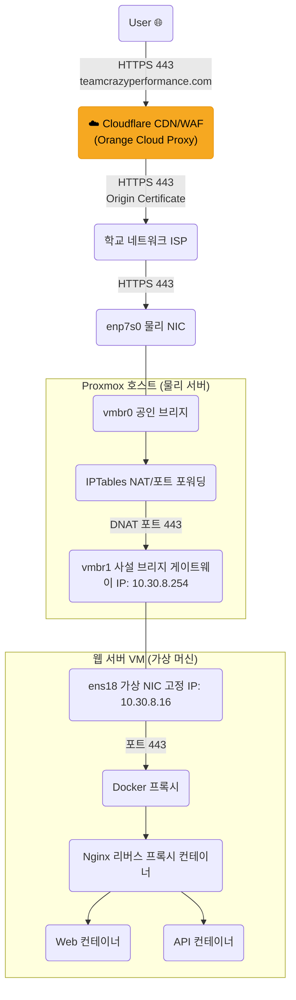

# 🌐 TCP 웹사이트 프로젝트 네트워크 아키텍처

현재 구축된 서비스 네트워크 구성도입니다.

### 1. 네트워크 다이어그램 (Mermaid)



---

## 📝 2. 계층별 상세 설정

### ☁️ Layer 0: Cloudflare 프록시 (Orange Cloud)
- **역할**: CDN, DDoS 방어, WAF, SSL 종료 및 재암호화 (Proxy 모드)
- **도메인**: `teamcrazyperformance.com`
- **DNS**: Cloudflare Proxied (🟠 Orange Cloud) — 사용자에게 원본 서버 IP가 노출되지 않음
- **SSL 모드**: Full (Strict) — Cloudflare와 Origin 모두 HTTPS
- **요청 흐름**:
  1. 사용자 → `teamcrazyperformance.com` DNS 조회 → Cloudflare Edge IP 반환
  2. 사용자 ↔ Cloudflare: Cloudflare의 공인 인증서로 HTTPS 연결
  3. Cloudflare ↔ Origin: Cloudflare Origin Certificate로 HTTPS 재연결
- **장점**: IP 은닉, DDoS 보호, 정적 자원 캐싱, HTTP/2 지원

### 🌍 Layer 1: 외부 네트워크 (학교 네트워크)
- **역할**: 인터넷 연결 제공 (ISP 역할)
- **공인 IP**: `117.17.186.12`
- **방화벽**: 80(HTTP), 443(HTTPS) 포트 인바운드 허용됨

### 🖥️ Layer 2: Proxmox 호스트 (물리 서버)
- **역할**: 가상화 호스트 및 라우터 (NAT 게이트웨이)
- **인터페이스**:
    - `vmbr0`: 공인 IP(`117.17.186.12`)를 할당받는 브리지. (외부 연결용)
    - `vmbr1`: 사설 IP(`10.30.8.254`)를 가진 내부 브리지. (VM 게이트웨이 역할)
- **라우팅 & NAT**:
    - **마스커레이드 (Outbound)**: `10.30.8.0/24` 대역(VM들)이 외부로 나갈 때 공인 IP(`117.17.186.12`)로 변환하여 나감.
    - **포트 포워딩 (Inbound)**:
        - `117.17.186.12:80` → `10.30.8.16:80`
        - `117.17.186.12:443` → `10.30.8.16:443`
        - **`117.17.186.12:9047` → `10.30.8.16:9047` (SSH)**

### 📦 Layer 3: 웹 서버 VM (Ubuntu 게스트)
- **역할**: 실제 서비스가 구동되는 가상 서버
- **인터페이스**:
    - `ens18`: `vmbr1`에 연결됨.
- **IP 설정 (고정)**:
    - **IP**: `10.30.8.16`
    - **서브넷**: `255.255.255.0`
    - **게이트웨이**: `10.30.8.254` (Proxmox 호스트)
    - **DNS**: `8.8.8.8` (Google DNS)

### 🐳 Layer 4: Docker & 애플리케이션
- **역할**: 서비스 애플리케이션 실행
- **네트워크**: Docker Bridge Network (`internal`)
- **컨테이너**:
    - `reverse-proxy` (Nginx): 호스트의 80, 443 포트를 점유. SSL 종료 및 트래픽 분기 담당.
    - `web`: 정적 웹 페이지 서빙.
    - `api`: 백엔드 로직 처리.
    - `db`: 데이터베이스.

---

## 🛠️ 주요 파일 및 명령어 경로

1. **Proxmox 네트워크 설정**: `/etc/network/interfaces`
2. **VM IP 설정**: `/etc/netplan/00-installer-config.yaml` (또는 `/etc/network/interfaces`)
3. **Docker 설정**: `~/Desktop/TCP_Wetsite_2025/docker-compose.yml`

---

## ✅ 3. 추가 점검 리스트 (네트워크 상태 점검)
네트워크 환경을 완벽하게 검증하기 위해 다음 항목들도 확인해 주시면 좋습니다.

### 1. DNS 설정 확인 (VM 내부)
인터넷은 되지만 도메인 이름 해석이 느리거나 안 될 수 있습니다.
```bash
resolvectl status
# 또는
cat /etc/resolv.conf
```
*`8.8.8.8` 같은 Public DNS가 보여야 합니다.*

### 2. Proxmox 방화벽 활성화 여부 (호스트)
Proxmox 자체 방화벽이 켜져 있으면 설정해둔 iptables NAT가 막힐 수 있습니다.
```bash
pve-firewall status
```
*`Status: disabled/running` 상태를 확인하세요. 켜져 있다면 80/443 허용 규칙이 필요합니다.*

### 3. 시간 동기화 (NTP) 및 타임존 설정
서버 시간이 틀리면 **SSL 인증서 오류**, **로그 불일치**, **OTP 인증 실패** 등이 발생하므로 반드시 동기화해야 합니다.

**1. 타임존 설정 (한국 시간 KST):**
```bash
sudo timedatectl set-timezone Asia/Seoul
```

**2. NTP 동기화 상태 확인:**
```bash
timedatectl
```
*`System clock synchronized: yes`로 되어 있어야 합니다.*

**3. NTP 서비스 설치 및 활성화 (systemd-timesyncd가 없을 경우):**

**해결 방법 1 (Chrony 확인):**
Proxmox는 기본적으로 `chrony`를 사용할 수도 있습니다.
```bash
systemctl status chrony
```
만약 `Active: active (running)`이라면 정상입니다.

**해결 방법 2 (systemd-timesyncd 설치):**
만약 아무것도 없다면 `systemd-timesyncd`를 설치해주면 됩니다.
```bash
apt update && apt install systemd-timesyncd
sudo service systemd-timesyncd start
sudo timedatectl set-ntp true
```
