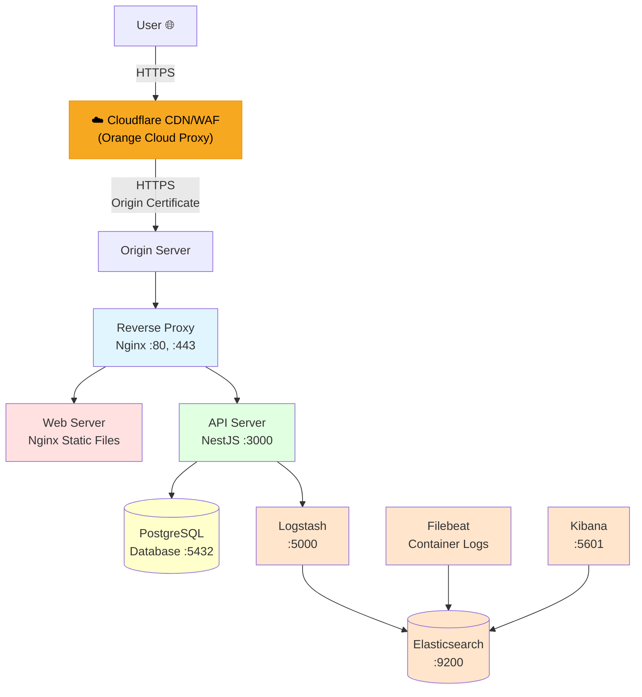

# 2. 인프라 및 배포

> [← 메인 문서로 돌아가기](./README.md)

---

## Docker 아키텍처

애플리케이션은 Docker Compose가 여러 컨테이너를 조율하는 **마이크로서비스 아키텍처**를 사용합니다.

### 아키텍처 다이어그램



---

## 네트워크 토폴로지

### Cloudflare 프록시 (Orange Cloud 🟠)
- **역할**: CDN, DDoS 방어, WAF, SSL 종료 및 재암호화
- **동작 방식**:
  1. 사용자 → `teamcrazyperformance.com` DNS 조회 → Cloudflare Edge IP 반환
  2. 사용자 ↔ Cloudflare: Cloudflare의 공인 인증서로 HTTPS 연결
  3. Cloudflare ↔ Origin: Cloudflare Origin Certificate로 HTTPS 재연결
- **장점**: 원본 서버 IP 은닉, DDoS 보호, 정적 자원 캐싱, HTTP/2 지원

### 네트워크 계층
- **공용 네트워크**: 리버스 프록시만 인터넷에 노출 (포트 80, 443)
- **내부 네트워크**: 다른 모든 서비스는 내부적으로 통신
  - 데이터베이스: 외부 노출 안 됨 (보안)
  - API: 리버스 프록시를 통해서만 접근 가능
  - ELK Stack: 내부 전용 (SSH 터널링을 통한 접근)

---

## 주요 서비스

### 1. Reverse Proxy (Nginx)

**목적**: 모든 HTTP/HTTPS 요청의 진입점

**라우팅**:
- `/api/*` → API 서버
- `/*` → 정적 웹 파일

**설정 파일**: `reverse-proxy/default.conf`

**주요 기능**:
- HTTP → HTTPS 리다이렉트 (포트 80 → 443)
- HTTPS with Cloudflare Origin Certificate (TLSv1.2/1.3)
- 도메인: `teamcrazyperformance.com`
- API 라우팅: `/api/*` → NestJS 서버
- 정적 파일: `/*` → React 빌드
- 업로드 파일 서빙: `/activities/`, `/profiles/`, `/resources/`, `/teams/` → API 서버

---

### 2. Web Server (Nginx)

**목적**: React 프로덕션 빌드 서빙

**서빙 디렉토리**: `./web/dist/`

**설정 파일**: `./web/nginx.conf`

**특징**:
- SPA 라우팅 지원 (모든 경로 → `index.html`)
- 정적 자산 캐싱
- Gzip 압축

---

### 3. API Server (NestJS)

**목적**: 백엔드 REST API

**포트**: 3000 (내부)

**환경**: Production (`NODE_ENV=production`)

**볼륨 마운트**:
- `./api/uploads` → 사용자 업로드 파일
- `./api/json` → 정적 JSON 데이터
- `./logs/app` → 애플리케이션 로그

**주요 기능**:
- RESTful API 엔드포인트
- JWT 인증
- 파일 업로드 처리
- 스케줄 작업 실행

---

### 4. PostgreSQL Database

**목적**: 주 데이터 저장소

**버전**: 16-alpine

**영속성**: 
- Docker 볼륨: `db-data`
- 백업 디렉토리: `./db/backups/`

**보안**:
- 내부 네트워크에서만 접근 가능
- SSH 터널을 통한 외부 접근 가능

---

### 5. ELK Stack (로깅 & 모니터링)

| 서비스 | 목적 | 포트 |
|---------|---------|------|
| **Elasticsearch** | 로그 저장 & 검색 엔진 | 9200 |
| **Logstash** | 로그 집계 & 처리 파이프라인 | 5000 |
| **Kibana** | 로그 시각화 대시보드 | 5601 |
| **Filebeat** | Docker 컨테이너 로그 수집 | - |

**로그 흐름**:
```
API 애플리케이션 → Winston → Logstash → Elasticsearch ← Filebeat (Docker 로그)
                                                ↓
                                             Kibana (시각화)
```

---

## 포트 요약

| 서비스 | 내부 포트 | 외부 포트 | 접근 |
|---------|-----------|-----------|------|
| Reverse Proxy | 80, 443 | 80, 443 | 공개 |
| Web | 80 | - | 내부 전용 |
| API | 3000 | - | 내부 전용 |
| PostgreSQL | 5432 | - | 내부 전용 |
| Elasticsearch | 9200 | - | 내부 전용 (SSH 터널) |
| Kibana | 5601 | - | 내부 전용 (SSH 터널) |
| Logstash | 5000 | - | 내부 전용 |

---

## SSH 터널링 (내부 서비스 접근)

Kibana나 PostgreSQL을 로컬 머신에서 접근하려면:

```bash
# Kibana 접근
ssh -L 5601:localhost:5601 user@your-server
# 그 다음 브라우저에서 http://localhost:5601 접속

# PostgreSQL 접근
ssh -L 5432:localhost:5432 user@your-server
# 그 다음 DB 클라이언트로 localhost:5432 연결
```

---

## Docker Compose 서비스 구성

### 프로덕션 환경 (`docker-compose.yml`)

```yaml
services:
  reverse-proxy:    # Nginx 리버스 프록시
  web:              # React 프로덕션 빌드
  api:              # NestJS 백엔드
  db:               # PostgreSQL
  elasticsearch:    # 로그 저장
  logstash:         # 로그 처리
  kibana:           # 로그 시각화
  filebeat:         # 로그 수집
```

### 개발 환경 (`docker-compose.dev.yml`)

```yaml
services:
  db:               # PostgreSQL만 Docker로 실행
                    # API와 Web는 로컬에서 직접 실행
```

---

## 다음 단계

- **[3. 백엔드 아키텍처 →](./03_백엔드_아키텍처.md)**: NestJS 모듈 구조와 핵심 시스템 이해하기
- **[← 1. 프로젝트 개요](./01_프로젝트_개요_및_기술스택.md)**
- **[← 메인 문서로 돌아가기](./README.md)**
