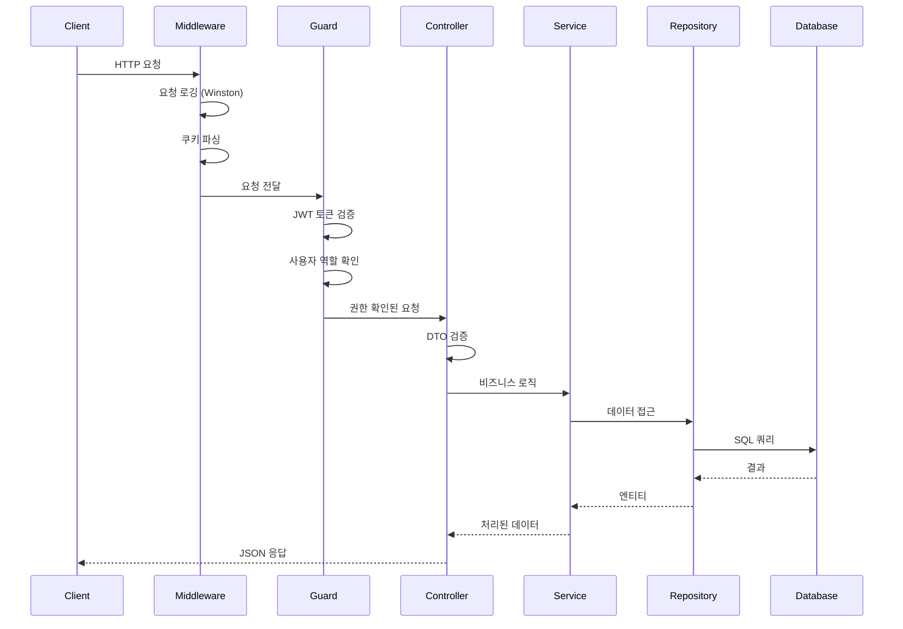
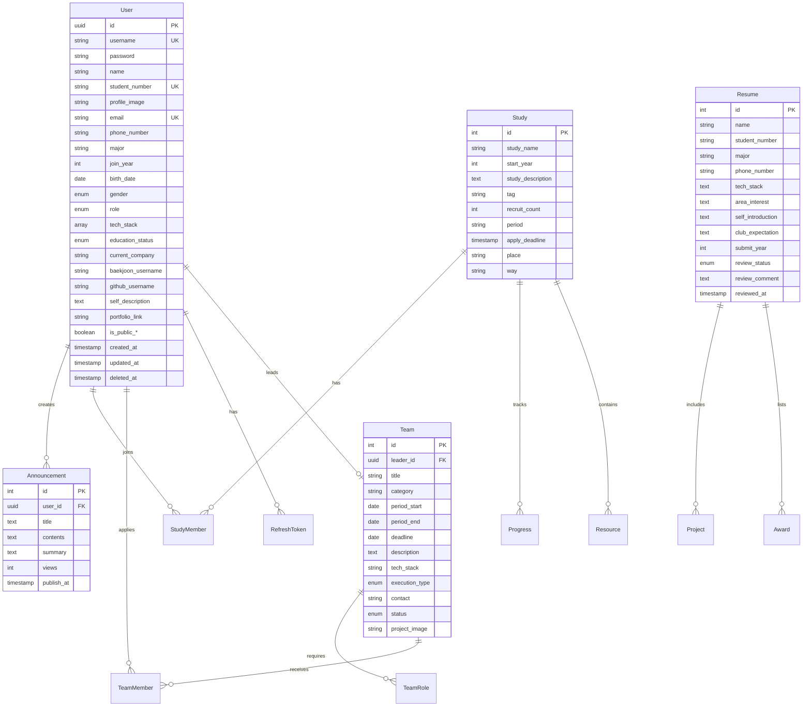
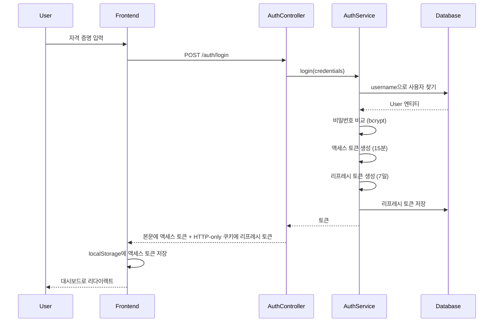

# 3. 백엔드 아키텍처

> [← 메인 문서로 돌아가기](./README.md)

---

## 아키텍처 패턴: 모듈러 모놀리스

백엔드는 NestJS의 모듈 아키텍처를 따르며, 기능을 독립적 모듈로 구성합니다.

## 모듈 구성

```
src/
├── 코어 모듈
│   ├── auth/                    # JWT 인증 & 인가
│   ├── logger/                  # Winston 로깅
│   ├── health/                  # 헬스 체크
│
├── 사용자 향 모듈
│   ├── members/                 # 공개 회원 디렉토리
│   ├── announcement/            # 동아리 공지사항
│   ├── study/                   # 스터디 그룹
│   ├── teams/                   # 팀/프로젝트 모집
│   ├── recruitment/             # 신규 회원 지원
│
├── 사용자 전용 모듈
│   ├── mypage/
│   │   ├── profile/            # 프로필 관리
│   │   ├── account/            # 계정 설정
│   │   ├── privacy/            # 프라이버시 설정
│   │   ├── study/              # 사용자의 스터디
│   │   ├── teams/              # 사용자의 팀
│   │   └── withdraw/           # 계정 삭제
│
├── 관리자 모듈
│   ├── admin/
│   │   ├── members/            # 사용자 관리
│   │   ├── announcement/       # 관리자 공지사항 작업
│   │   ├── statistics/         # 대시보드 통계 & 지표
│   │   ├── system/             # 시스템 모니터링
│   │   └── activity-images/    # 활동 사진 관리
│
├── 공개 데이터 모듈
│   └── main-page/              # 홈페이지 데이터 API
│                                 # (통계 + 활동 이미지 집계)
│
└── 백그라운드 작업
    └── jobs/
        ├── member-cleanup.job       # 소프트 삭제 사용자 정리
        └── recruitment-settings.job # 모집 상태 업데이트
```

---

## 요청 처리 흐름



---

## 핵심 시스템

### 1. 인증 시스템

**위치**: `src/auth/`

**기능**:
- JWT 기반 인증 (액세스 & 리프레시 토큰)
- 역할 기반 접근 제어 (ADMIN, MEMBER, GUEST)
- HTTP-only 쿠키를 통한 안전한 토큰 저장
- Passport.js 전략

**주요 파일**:
- `auth.service.ts`: 로그인, 등록, 토큰 관리
- `jwt.strategy.ts`: JWT 검증
- `jwt-auth.guard.ts`: 라우트 보호
- `roles.guard.ts`: 사용자 권한 확인

**토큰 플로우**:
```
1. 사용자 로그인 → 액세스 토큰 (15분) + 리프레시 토큰 (7일) 발급
2. 액세스 토큰은 HTTP-only 쿠키에 저장
3. 리프레시 토큰은 데이터베이스 + HTTP-only 쿠키에 저장
4. 액세스 토큰 만료 시 → 리프레시 토큰으로 새 액세스 토큰 발급
5. 리프레시 토큰은 폐기 가능 (로그아웃)
```

---

### 2. 로깅 시스템

**위치**: `src/logger/`

**Winston 설정**:
- **Console Transport**: 개발 로깅
- **File Transport**: 애플리케이션 로그 → `./logs/app/`
- **Logstash Transport**: 프로덕션에서 ELK 스택으로 로그 전송

**미들웨어**: `HttpLoggerMiddleware`가 모든 HTTP 요청 로깅:
- 메서드, URL, 상태 코드
- 응답 시간
- User Agent
- IP 주소

---

### 3. 스케줄 작업

**위치**: `src/jobs/`

| 작업 | 스케줄 | 목적 |
|------|--------|------|
| `MemberCleanupJob` | 매일 오전 2시 | 30일 이상 소프트 삭제된 사용자 영구 삭제 |
| `RecruitmentSettingsJob` | 10분마다 | 마감 후 자동으로 모집 기간 종료 |

---

### 4. 헬스 체크

**위치**: `src/health/`

**엔드포인트**:
- `GET /health/live` - 생존 프로브 (서버가 실행 중인가?)
- `GET /health/ready` - 준비 프로브 (요청을 처리할 수 있는가?)
- `GET /health/db` - 데이터베이스 연결 상태

---

## 주요 모듈 상세

### Study 모듈 (`src/study/`)

**목적**: 회원, 진행 상황 추적, 리소스를 포함한 스터디 그룹 관리

**엔티티**:
- `Study`: 스터디 그룹 정보
- `StudyMember`: 스터디의 사용자 멤버십
- `Progress`: 주간 진행 상황 추적
- `Resource`: 학습 자료 및 링크

**주요 기능**:
- 스터디 그룹 생성/수정/삭제
- 스터디 가입/탈퇴
- AI 요약과 함께 주간 진행 상황 추적
- 스터디 리소스 업로드 및 관리
- 파일 업로드 지원 (이미지, PDF 등)

**API 예제**:
```
POST   /study                    # 스터디 생성
GET    /study/:id                # 스터디 상세 조회
POST   /study/:id/join           # 스터디 가입
POST   /study/:id/progress       # 진행 상황 제출
POST   /study/:id/resources      # 리소스 업로드
```

---

### Teams 모듈 (`src/teams/`)

**목적**: 팀/프로젝트 모집 게시

**엔티티**:
- `Team`: 팀 정보
- `TeamRole`: 필요한 역할 (예: 프론트엔드 개발자, 디자이너)
- `TeamMember`: 팀에 대한 사용자 지원

**주요 기능**:
- 여러 역할 모집 게시글 생성
- 역할별 지원 추적
- 역할이 채워지면 자동으로 모집 마감
- 온라인/오프라인 실행 유형 지원
- 프로젝트 시각화를 위한 이미지 업로드

---

### Recruitment 모듈 (`src/recruitment/`)

**목적**: 동아리 신규 회원 지원 처리

**엔티티**:
- `Resume`: 지원서 양식
- `Project`: 지원자의 이전 프로젝트
- `Award`: 지원자의 수상/성과
- `RecruitmentSettings`: 모집 기간 설정

**주요 기능**:
- 이력서와 함께 지원서 제출
- 관리자 검토 시스템 (PENDING → ACCEPTED/REJECTED)
- 자동 모집 기간 관리
- 연도별 조직

**검토 워크플로우**:
```
1. 지원자가 이력서 제출 → 상태: PENDING
2. 관리자가 지원서 검토 → 코멘트 추가
3. 관리자가 결정 → ACCEPTED 또는 REJECTED
4. 타임스탬프 기록 (reviewed_at)
```

---

### Announcement 모듈 (`src/announcement/`)

**목적**: 동아리 뉴스 및 공지사항

**기능**:
- 마크다운 콘텐츠 지원
- 조회수 카운터
- 예약 게시 (`publishAt` 필드)
- 작성자 추적

---

### MyPage 모듈 (`src/mypage/`)

`/mypage` 아래 그룹화된 사용자 전용 기능:

| 모듈 | 목적 |
|--------|---------||
| `profile` | 사용자 프로필 조회/수정 |
| `account` | 비밀번호, 이메일 변경 |
| `privacy` | 프라이버시 설정 (공개 정보 제어) |
| `study` | 사용자의 스터디 멤버십 |
| `teams` | 사용자의 팀 지원 |
| `withdraw` | 계정 소프트 삭제 |

---

## 데이터베이스 모델

### Entity Relationship Diagram



---

## 사용자 역할 및 권한

```typescript
enum UserRole {
  ADMIN = 'ADMIN',      // 전체 접근
  MEMBER = 'MEMBER',    // 활동 회원
  GUEST = 'GUEST'       // 승인 대기
}
```

**권한 수준**:
- **ADMIN**: 모든 작업 + 관리자 패널 접근
- **MEMBER**: 스터디/팀 생성, 활동 참여, 자신의 콘텐츠 관리
- **GUEST**: 읽기 전용 접근, 콘텐츠 생성 불가 (신규 사용자)

### 열거형

**User**:
- `UserGender`: Male, Female
- `UserRole`: ADMIN, MEMBER, GUEST
- `EducationStatus`: 재학 (Enrolled), 휴학 (Leave), 졸업 (Graduated)

**Study**:
- `StudyMemberRole`: PENDING, MEMBER, LEADER, NOMINEE

**Team**:
- `TeamStatus`: OPEN, CLOSED
- `ExecutionType`: ONLINE, OFFLINE, HYBRID

**Recruitment**:
- `ReviewStatus`: PENDING, REVIEWED, ACCEPTED, REJECTED

---

## 인증 & 인가

### 인증 플로우



### 토큰 유형

| 토큰 유형 | 수명 | 저장소 | 용도 |
|------------|----------|---------|---------||
| **액세스 토큰** | 15분 | localStorage (프론트엔드) | `Authorization: Bearer` 헤더를 통한 API 인증 |
| **리프레시 토큰** | 7일 | HTTP-only 쿠키 + 데이터베이스 | `/api/v1/auth/refresh`를 통한 액세스 토큰 갱신 |

### 보호된 라우트

**가드**:
- `JwtAuthGuard`: 유효한 액세스 토큰 검증
- `RolesGuard`: 사용자가 필요한 역할을 가졌는지 확인

**사용 예시**:
```typescript
@UseGuards(JwtAuthGuard, RolesGuard)
@Roles(UserRole.ADMIN)
@Get('admin/users')
async getAllUsers() {
  // 관리자만 접근 가능
}
```

### 비밀번호 보안

- **해싱 알고리즘**: bcrypt
- **솔트 라운드**: 10 (기본값, `BCRYPT_SALT_ROUNDS`로 설정 가능)
- **비밀번호 요구사항**: DTO 검증기로 강제

---

## 다음 단계

- **[4. 프론트엔드 아키텍처 →](./04_프론트엔드_아키텍처.md)**: React 구조와 주요 기능 이해하기
- **[← 2. 인프라 및 배포](./02_인프라_및_배포.md)**
- **[← 메인 문서로 돌아가기](./README.md)**
